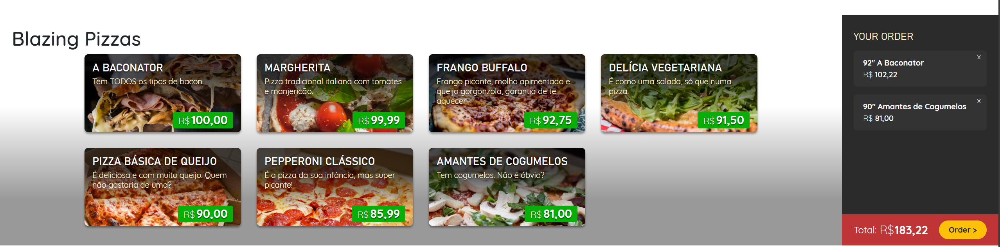

# Blazing Pizza - Projeto de Estudos



## 📝 Descrição

O Blazing Pizza é uma aplicação de uma pizzaria online onde é possível visualizar, customizar e pedir pizzas. O principal objetivo deste repositório é colocar em prática conceitos fundamentais do Blazor, como componentização, acesso a dados, gerenciamento de estado e data binding, utilizando a stack de tecnologias da Microsoft.

## ✨ Funcionalidades

* Visualização de um cardápio de pizzas.
* Customização de pizzas com diferentes ingredientes.
* Adição de itens ao carrinho de compras em tempo real.
* Visualização do total do pedido.

## 🚀 Tecnologias Utilizadas

O projeto foi construído com as seguintes tecnologias:

* **.NET 6**: Plataforma de desenvolvimento.
* **C#**: Linguagem de programação principal.
* **Blazor Server**: Framework para construção da interface do usuário.
* **Entity Framework Core**: ORM para acesso a dados.
* **SQLite**: Banco de dados utilizado para armazenamento local.

## 🏁 Começando

Para executar este projeto localmente, você precisará ter o SDK do .NET 6 instalado.

1.  **Clone o repositório:**
    ```bash
    git clone [https://github.com/MarcoTullio1/BlazingPizza.git](https://github.com/MarcoTullio1/BlazingPizza.git)
    ```
2.  **Acesse o diretório do projeto:**
    ```bash
    cd BlazingPizza
    ```
3.  **Restaure as dependências:**
    ```bash
    dotnet restore
    ```
4.  **Execute a aplicação:**
    ```bash
    dotnet run
    ```
    A aplicação estará disponível em `https://localhost:5001` ou `http://localhost:5000`.

---

# Contributing

This project welcomes contributions and suggestions. Most contributions require you to agree to a
Contributor License Agreement (CLA) declaring that you have the right to, and actually do, grant us
the rights to use your contribution. For details, visit https://cla.opensource.microsoft.com.

When you submit a pull request, a CLA bot will automatically determine whether you need to provide
a CLA and decorate the PR appropriately (e.g., status check, comment). Simply follow the instructions
provided by the bot. You will only need to do this once across all repos using our CLA.

This project has adopted the [Microsoft Open Source Code of Conduct](https://opensource.microsoft.com/codeofconduct/).
For more information see the [Code of Conduct FAQ](https://opensource.microsoft.com/codeofconduct/faq/) or
contact [opencode@microsoft.com](mailto:opencode@microsoft.com) with any additional questions or comments.

# Legal Notices

Microsoft and any contributors grant you a license to the Microsoft documentation and other content
in this repository under the [Creative Commons Attribution 4.0 International Public License](https://creativecommons.org/licenses/by/4.0/legalcode),
see the [LICENSE](LICENSE) file, and grant you a license to any code in the repository under the [MIT License](https://opensource.org/licenses/MIT), see the
[LICENSE-CODE](LICENSE-CODE) file.

Microsoft, Windows, Microsoft Azure and/or other Microsoft products and services referenced in the documentation
may be either trademarks or registered trademarks of Microsoft in the United States and/or other countries.
The licenses for this project do not grant you rights to use any Microsoft names, logos, or trademarks.
Microsoft's general trademark guidelines can be found at http://go.microsoft.com/fwlink/?LinkID=254653.

Privacy information can be found at https://privacy.microsoft.com/en-us/

Microsoft and any contributors reserve all other rights, whether under their respective copyrights, patents,
or trademarks, whether by implication, estoppel or otherwise.
